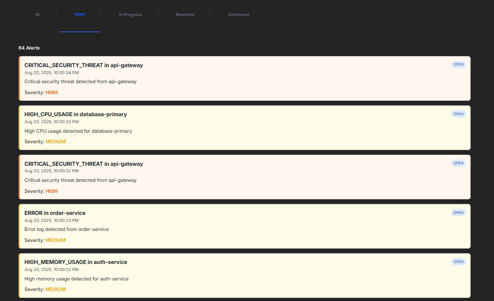
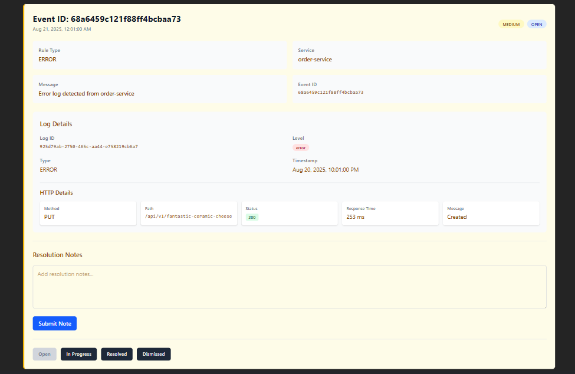
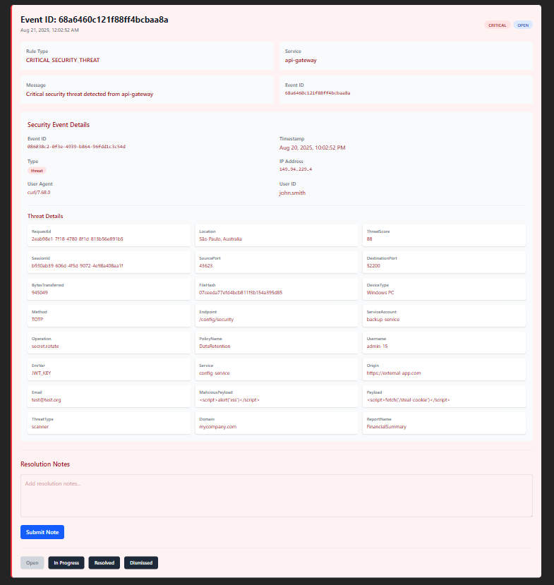
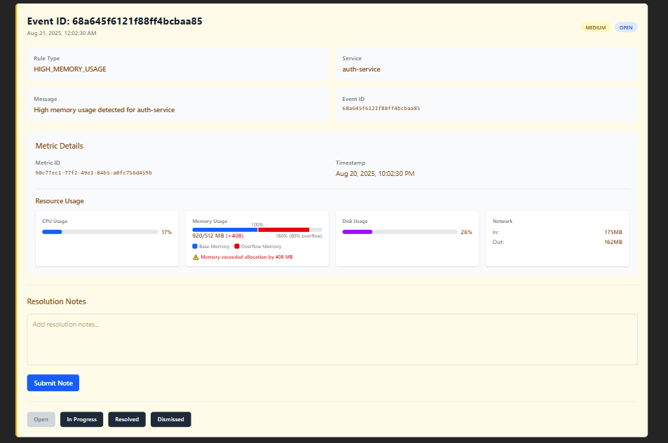

# System Monitoring Dashboard

An **observability platform** that ingests logs, metrics and security events, evaluates rule-based alerts in real-time and presents everything in a React dashboard with live updates via WebSockets. The system includes an AI Agent that provides actionable solutions for alerts.

<div style="display: flex; flex-direction: column; align-items: center; gap: 20px;">
  <div style="display: flex; justify-content: center;">
    
  </div>

  <div style="display: flex; justify-content: center; gap: 20px;">
    
    
    
  </div>
</div>

---

## Table of Contents

1. [Features](#features)
2. [Architecture](#architecture)
3. [Quick Start](#quick-start)
4. [Service Overview](#service-overview)
5. [API Reference](#api-reference)

---

## Features

| Domain          | Capabilities                                                             |
| --------------- | ------------------------------------------------------------------------ |
| **Collection**  | REST ingestion for logs, metrics & security events                       |
| **Rules**       | Declarative thresholds (CPU, memory, error rate, security severity)      |
| **Alerts**      | Real-time push to dashboard via WebSockets; acknowledge/resolve workflow |
| **AI Analysis** | Intelligent alert resolution suggestions with continuous learning        |
| **Storage**     | MongoDB collections                                                      |
| **Frontend**    | React + TypeScript + Tailwind, responsive cards, live updates            |

---

## Architecture


## Quick Start

#### Prerequisites

- Docker & Docker Compose
- Java 21 (for local Spring work)
- Node 20 (for local React work)
- Python 3.13 (for AI agent)

#### 1. Clone the repository

```bash
git clone https://github.com/petarkosic/system-monitoring
cd system-monitoring
```

#### 2. Configuration

Create a .env file next to docker-compose.yml:

```bash
MONGO_URI=mongodb://mongodb:27017/alertdb

RABBITMQ_USERNAME=default
RABBITMQ_PASSWORD=default

# Internal hostnames (Docker network)
RABBITMQ_HOST=rabbitmq

# The system uses Gemini as an LLM of choice, so the base url must be changed to address that
API_KEY=<your gemini api key here>
BASE_URL=https://generativelanguage.googleapis.com/v1beta/openai/
```

For local development, override hostnames to `localhost.`

#### 3. Run the project

```bash
docker compose up --build
```

This will build the necessary Docker images and start all the containers.

#### 4. Open

Dashboard → http://localhost:3000

## Service Overview

| Service              | Tech Stack       | Port       | Responsibilities                                       |
| -------------------- | ---------------- | ---------- | ------------------------------------------------------ |
| **data-collector**   | Spring Boot 3.5  | 8081       | Ingest endpoints `/api/{logs,metrics,security-events}` |
| **rule-engine**      | Spring Boot 3.5  | 8082       | Consumes queues, evaluates rules, publishes alerts     |
| **alert-manager**    | Spring Boot 3.5  | 8083       | CRUD for alerts, WebSocket push `/topic/alerts`        |
| **ai-agent**         | FastAPI + Python | 8000       | AI-powered alert resolution suggestions                |
| **log-service**      | Node 24 + TS     | —          | Generates realistic log traffic                        |
| **metrics-service**  | Node 24 + TS     | —          | Generates realistic metrics                            |
| **security-service** | Node 24 + TS     | —          | Generates realistic security events                    |
| **client**           | React + Vite     | 3000       | Dashboard, live updates, alert workflow                |
| **mongodb**          | Mongo            | 27017      | Persistent store                                       |
| **rabbitmq**         | 4.1-management   | 5672/15672 | Message broker & UI                                    |

## API Reference

##### Data-Collector (8081)

| Verb     | Endpoint             | Body Example                                |
| -------- | -------------------- | ------------------------------------------- |
| **POST** | /api/logs            | `{logId, timestamp, service, level, ...}`   |
| **POST** | /api/metrics         | `{metricId, timestamp, service, cpu, ...}`  |
| **POST** | /api/security-events | `{eventId, timestamp, type, severity, ...}` |

##### Alert-Manager (8083)

| Verb      | Endpoint               | Description                            |
| --------- | ---------------------- | -------------------------------------- |
| **GET**   | /api/alerts            | All alerts, sorted newest              |
| **GET**   | /api/alerts/:id        | Single alert                           |
| **PATCH** | /api/alerts/:id/status | OPEN, IN_PROGRESS, RESOLVED, DISMISSED |
| **PATCH** | /api/alerts/:id/note   | plain-text note                        |

##### AI Agent (8000)

| Verb     | Endpoint             | Description                                |
| -------- | -------------------- | ------------------------------------------ |
| **GET**  | /health              | Verify service health                      |
| **POST** | /api/analyze-alert   | Analyze an alert and get solutions         |
| **POST** | /api/record-feedback | Provide feedback on solution effectiveness |
